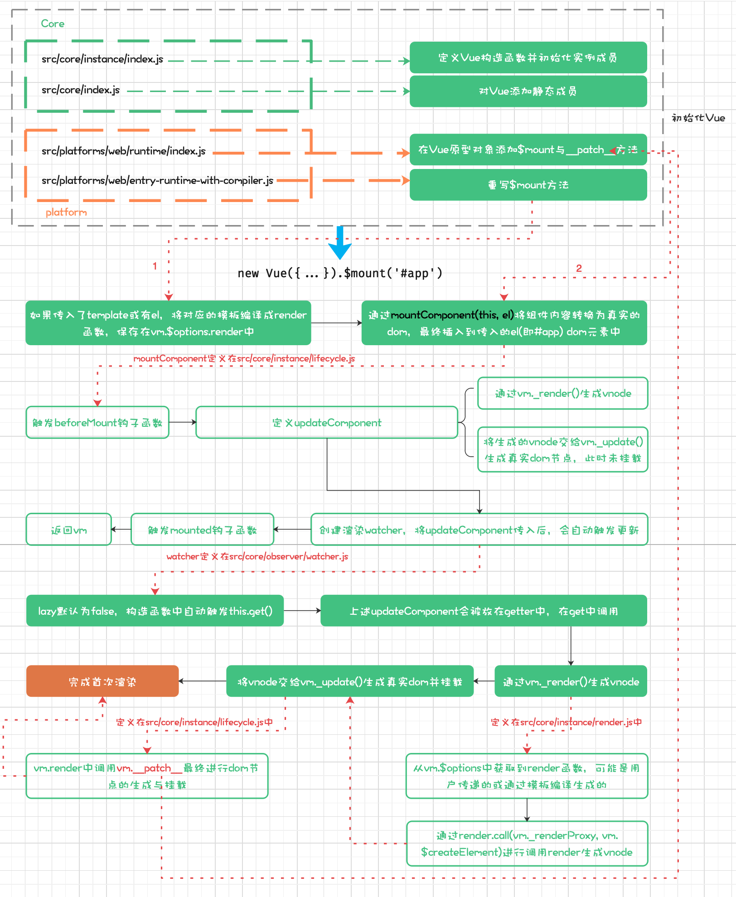
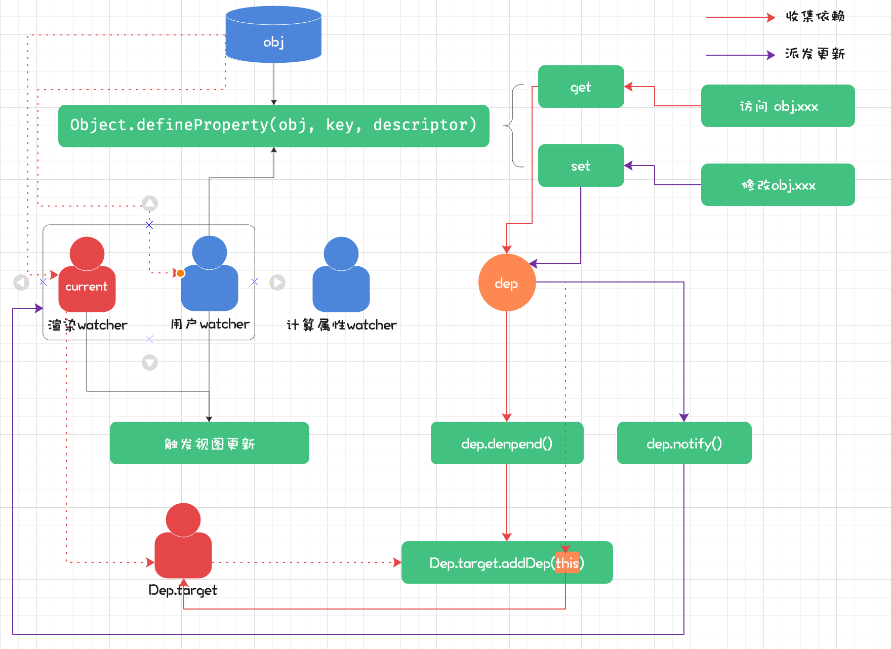

# module_6
响应式、虚拟 DOM、模板编译和组件化

## 请简述 Vue 首次渲染的过程
-  在Vue渲染之前需要创建Vue构造函数,初始化它的实例成员与静态成员然后在webplatform中为Vue添加web平台下会使用到的方法,`$mount`与`__patch__`方法
- 在上一步基础上拥有了一个可用的Vue类,通过`new Vue({...}).$mount('#app')`可以生成dom元素并挂载
  - 判断用户是否传入render函数,如果没有传入就找到传入的模板编译为render函数,保存在`vm.$options`中
  - 然后通过`mountComponent(this,el)`进行挂载
  - `mountComponent`的核心是创建`updateComponent`和`渲染watcher`,将`updateComponent`传递进去,在此之前会调用beforeMount钩子函数,之后会调用mounted钩子函数
  - 在`渲染watcher`创建过程中执行构造函数时,由于lazy属性默认为false此时会直接调用`this.get()`方法
  - 在get方法会调用`updateComponent`,此时`updateComponent`会被保存在watcher的getter属性中
  - `updateComponent`中通过`vm.render`函数生成vnode,这里的render就是用户传入或模板编译的
  - 生成vnode之后将其传递给`vm.update()`生成真实的dom元素,并挂载在页面中,其中的核心是调用web平台传入的`__patch__`方法

流程图



## 简述Vue的响应式原理



Vue2.0响应式数据通过`Object.defineProperty`方法定义,在`get`中拦截了用户对数据访问,中间插入依赖收集过程,在`set`中拦截用户对数据修改,插入了通知更新操作在这个操作过程中涉及观察者模式,在观察者`watcher`中会包含一些出触发页面更新操作,在发布者`dep`中可以通过`notify()`方法触发依赖dep的watcher进行更新视图操作

**Vue订阅事件(紫色)**

当用户访问一个响应式对象属性时,会触发`get`拦截操作,此时调用`dep.depended()`方法,通过`Dep.target`保证当前全局唯一正在使用的watcher,将dep添加到watcher,一个数据可能在不同地方用到,它可能会被添加到不同的watcher中,从而将数据与watcher建立关联

**Vue事件触发(红色)**

当用户修改一个响应式数据时,会触发`set`拦截操作,如果设置新值为对象,会将其改变为响应式对象,此时会触发dep的`dep.notify()`方法,遍历所有拥有与当前dep的watcher的update()方法,执行用户传入更新视图回调,从而达到修改数据页面跟随变化现象

## 简述虚拟dom中key的作用和好处

举例说明:如果一组div内容分别为[1,2,3,4],在1之后插入100变成[1,100,2,3,4]

**不设置key更新**

在执行updateChildren更新children时,节点最后内容不一样,其余都相同,新旧指针对应的节点都是相同的节点,然后调用patchNode进行dom更新,除了新旧第一个节点外其它也是相同,此时不会操作dom,从2-4每个节点都会判断是否是同一节点,patchVnode执行text不同,因此会操作三次dom,最后剩余一个4,会创建dom元素,插入页面,总共操作4次dom

**设置key更新**

在执行updateChildren时,2与100对应的vnode不是相同的vnode,然后从尾部开箱比起,4,3,2对应的新旧节点都相同并且前后的text没变化,因此patchNode不会操作dom,最后结束的时候新的children多出一个vnode,文本内容为2,此时创建一个dom元素,插入到1后面执行一次dom操作

## 简述Vue中模板编译过程


- `createCompilerCreator(baseCompile)`函数传入`bseCompile`最终生成`createCompiler`函数,parse将template编译成ast,optimize优化ast,标记静态节点和静态根节点,最后通过`generate()`将ast重新生成code
- 将生成`createCompiler`函数传入`baseOptions`,定义`compile`函数,在`compile`将`baseOptions`与后来用户传入的`options`合并,调用`baseCompile`生成code定义完compile返回`compileToFunctions`函数,这个函数通过运行`createCompileToFunctionFn(compile)`传入compile,`createCompileToFunctionFn`作用是通过闭包将传入的`compile`保存起来,然后直接定义并返回`compileToFunctions`函数
- `compileToFunctions`函数就是最终在`entry-runtime-with-compiler`中调用的将模板转换为render函数的工具,`createCompileToFunctionFn`中最核心的事情就是盗用了compile函数，从而调用`baseCompile`，拿到生成字符串code，在通过createFunction将字符串转换为函数
- ```javascript
  // 最终通过`createElement`创建vnode
  vm._c = (a, b, c, d) => createElement(vm, a, b, c, d, false)
  ```
